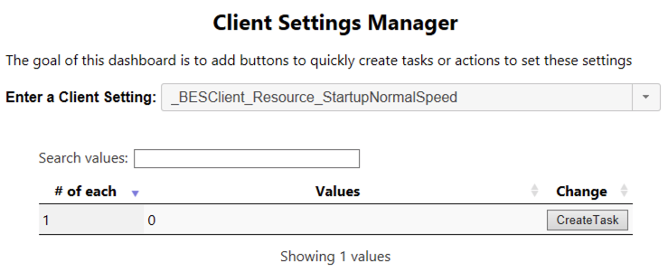

<!-- git pull;pandoc 2018-10-30-BigFix-Settings-Optimizations.md -o BigFix_tmp.pptx;open BigFix_tmp.pptx -->

## BigFix is Extremely Flexible

- There are tons of setting that can be tweaked for almost every part of the BigFix platform.
  - Root Server: `_BESRelay_` & `_BESGather_`
  - Relays: `_BESRelay_` & `_BESGather_`
  - Clients: `_BESClient_`
  - and more!
- No matter what your use case is, there is a setting that can help!

## Many Defaults Should Be Changed!

- There are many default BigFix Settings that are sub-optimal for almost all use cases!
  - This will cover the ones with the biggest impact, that are also safest to deploy.
- BigFix is very conservative about Defaults, and especially changing them once they have been established.

## _BESClient_Resource_PowerSaveEnable

### Default: Disabled (0)

### Recommendation: Enabled (1)

- This setting should be enabled on:
  - Laptops
  - VMs
  - Docker Containers
  - & probably everything else
- This setting tells the client to stop evaluating relevance if things are not changing.
  - The client will wake if notified of new content.

## _BESClient_Resource_AccelerateForPendingMessage

### Default: Disabled (0)

### Recommendation: Enabled (1)

- This setting should be enabled everywhere
- Allows BigFix to wakeup due to new actions (UDP)

## _BESClient_Log_Days

### Default: 10 days (10)

### Recommendation: 31 days (31)

- This setting controls how many log files the client will keep before deleting the oldest. 
- The default of 10 days is often too short to catch issues before logs are rotated.

## _BESRelay_HealthCheck_EnableAtStartup

### Default: Disabled (0)

### Recommendation: Enabled (1)

- Applies to Relays
- HealthCheck process validates site data integrity, and re-requests any site data that is corrupt so it can be properly served to clients.
- Can Fix `FAILED to Synchronize` errors in client logs

## _BESRelay_RelaysFileUpdater_RefreshSeconds

### Default: 1 minute (60)

### Recommendation: 1 hour (3600) or more

Applicability: root server only (exists main gather service)

- This setting controls how often the Relays.dat file is propagated when new Relays are created.
- This setting matters most if new Relays are created frequently, but the default setting is extremely aggressive.

## _BESClient_Comm_CommandPollEnable

### Default: Disabled (0)

### Recommendation: Enabled (1)

- It should be enabled on 100% of endpoints, it is just a matter of how frequent the command polling should be done.
- The frequency of command polling is controlled by [the setting](https://github.com/jgstew/jgstew.github.io/blob/master/_bfsettings/_BESClient_Comm_CommandPollIntervalSeconds.md): 
  - `_BESClient_Comm_CommandPollIntervalSeconds`

## _BESClient_Comm_CommandPollIntervalSeconds

### Default: 12 hours (43200)

### Recommendation: 3 hours (10800)

- This setting controls how often a client polls for commands, if [enabled by](https://github.com/jgstew/jgstew.github.io/blob/master/_bfsettings/_BESClient_Comm_CommandPollEnable.md): 
  - `_BESClient_Comm_CommandPollEnable`
- All systems should have it set to at least once every 6 hours.
- Those not getting UDP should have a more aggressive value.
  - Generally not more often than once every 30 minutes

## _BESClient_Download_UtilitiesCacheLimitMB

### Default: 10MB (10)

### Recommendation: 200MB (200) or more

- This setting controls the maximum size of the storage for utilities in a cache that does not get cleared out in the same way as the Client's Download Cache.
- This cache is designed for small files that are used across many different actions where you would not want them to have to be redownloaded everytime.

## I'm Convinced, Now What?

### 4 Actions Designed to Target ALL COMPUTERS:

- [***Run Once:***](https://github.com/jgstew/bigfix-content/blob/master/fixlet/clientsettings/Recommended%20Client%20Settings%20-%20Initial%20Provisioning%20Speed%20up%20-%20Long%20term%20settings.bes) Set initial client settings if unset
- [***Run Always:***](https://github.com/jgstew/bigfix-content/blob/master/fixlet/clientsettings/Set%20__BESClient_Comm_CommandPollEnable_%20to%20_1_%20-%20Universal.bes) Force command polling to be enabled
- [***Run Always:***](https://github.com/jgstew/bigfix-content/blob/master/fixlet/clientsettings/Force%20CommandPollInterval%20to%20be%20less%20than%206%20hours%20-%20Universal%20-%20Policy.bes) Set command polling to at least once every 6 hours
- [***Run Once:***](https://github.com/jgstew/bigfix-content/blob/master/fixlet/clientsettings/Set%20__BESClient_Resource_PowerSaveEnable_%20to%20_1_%20after%202%20days%20-%20Universal.bes) Set `_BESClient_Resource_PowerSaveEnable` after 2 days in BigFix

## What about new BigFix clients?

### prepopulate settings with clientsettings.cfg

- Can be used with Windows & Mac installers (EXE & PKG)
- Can be used with Linux installers [using a script](https://github.com/jgstew/tools/blob/fa64fb29cac7788166b883c1a41c45a6f6ed7d58/bash/install_bigfix.sh#L277)
- Will improve BigFix performance from the start!

## What about other settings?

## Questions?

### forum.bigfix.com
### bigfix.slack.com

## References:

- https://github.com/jgstew/jgstew.github.io/tree/master/_bfsettings
- https://github.com/jgstew/bigfix-content/issues/2
- https://github.com/jgstew/bigfix-content/blob/master/dashboards/ClientSettingsManager.ojo
